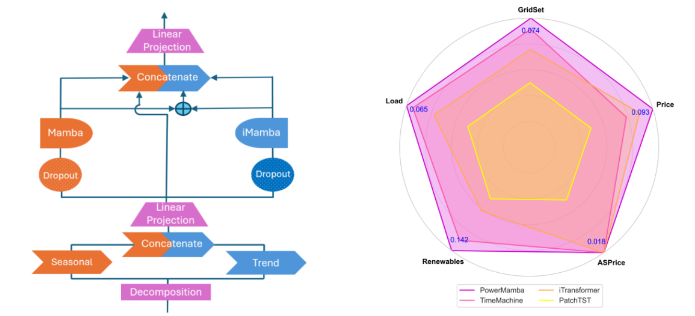
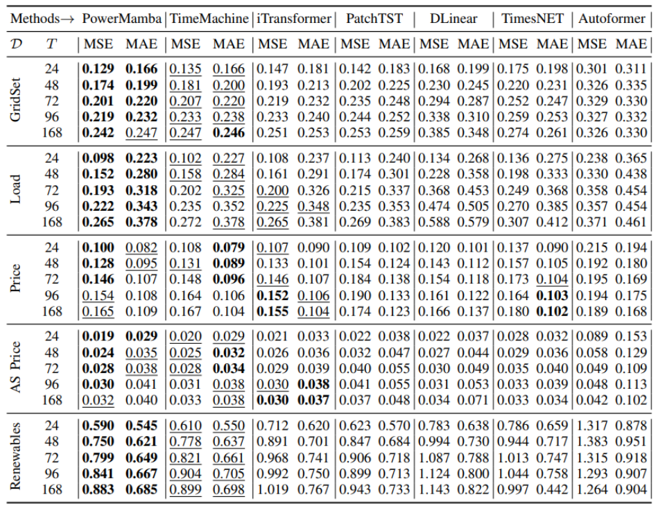
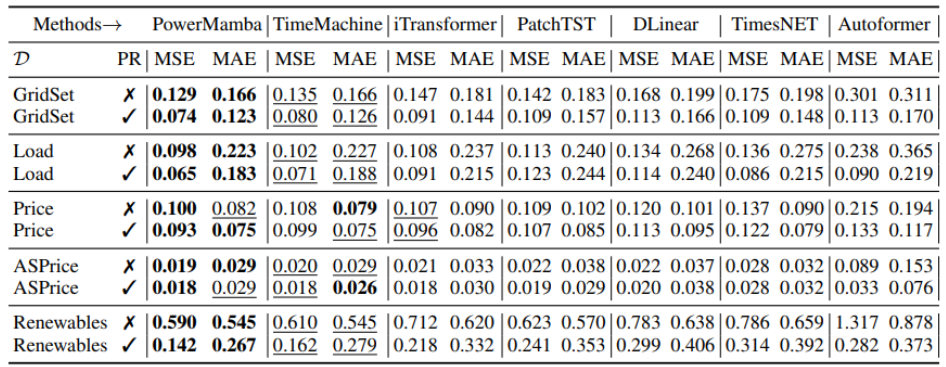
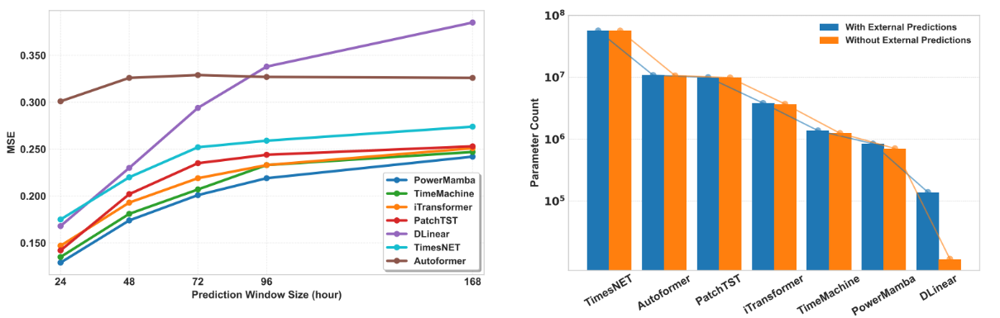
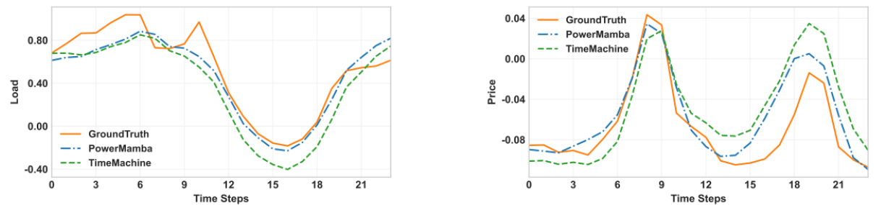
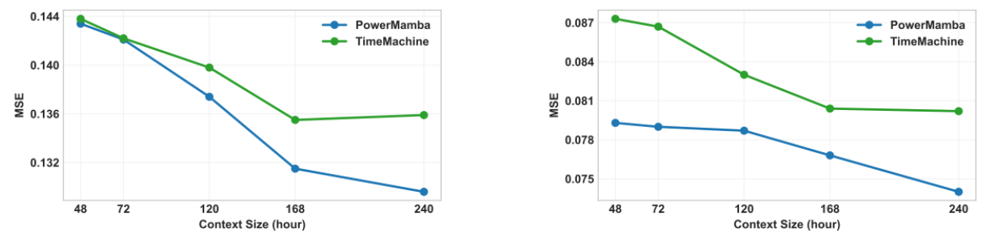

# <center>PowerMamba</center>

This repository contains the code and resources for the research project "[PowerMamba: A Deep State Space Model and Comprehensive Benchmark for Time Series Prediction in Electric Power Systems](https://arxiv.org/abs/2412.06112)."

We release a comprehensive dataset for the Electric Reliability Council of Texas (ERCOT) grid, which includes zonal loads, zonal electricity prices, ancillary service prices, and renewable generation time series with hourly granularity. This dataset spans five years and provides zonal-level spatial resolution, featuring 22 core time series and an extended version with 262 channels that includes external forecasts. The architecture and performance of our prediction model are presented in the following figures:

<div style="text-align: center;">
    
</div>

**Left**) PowerMamba architecture. The model uses dynamic time series
decomposition to separate seasonal and trend components and
applies linear projections to maintain a fixed size. Parallel
normal and inverse Mamba blocks enable dual tokenization,
capturing intra-series and inter-series dependencies. **Right**) Average Mean Squared Error (MSE) comparison
between PowerMamba and state-of-the-art baselines with a
context length of 240 hours and a 24-hour prediction window.
The circle center represents the maximum possible error, and
closer to the boundary indicates better performance. PowerMamba outperforms current benchmarks in all prediction tasks. 


**Results without External Forecasts:** We propose a time series processing block that seamlessly integrates high-resolution external forecasts into our models and other sequence-to-sequence frameworks. We evaluate its effectiveness by considering two scenarios: first, we train with historical data alone, and then we incorporate external forecasts and compare the results. The following Table shows the prediction results for the case without external predictions.




**Results with Integrating Externla Forecasts:** Next, we integrate the external predictions provided for load and renewable generation into our dataset. The following Table compares the prediction accuracy of our model and the baselines with and without external predictions. A fixed context size of L = 240 and a prediction window size of W = 24 are used for all the baselines.




The results indicate that our model's performance improves for all time series even those without external predictions. For example, price
prediction error is reduced by 7%, despite the absence of external price predictions.


**Computational Efficiency:** As shwon below, PowerMamba is highly robust and it consistently outperforms other models in both short- and long-
term predictions. We also compare the number of trainable parameters for all the baseline models.

<div style="text-align: center; margin-top: 20px;">
    
    
**Left**) MSE of all models for different prediction window
sizes, with context length L = 240 and no external predictions. **Right**) The number of model parameters with and without
external predictions, in log scale.

PowerMamba enhances the average prediction error of TimeMachine by 7% while employing 43% fewer parameters,
thereby highlighting its superiority over this state-of-the-art
Mamba-based model. Furthermore, PowerMamba is considerably smaller than Transformer-based models, with 78% fewer
parameters than the leading iTransformer.

**Qualitative Comparison:** Although both models are able to accurately
depict load and price patterns, PowerMamba exhibits superior
alignment, especially around peaks and troughs.



The ground truth and 24-hour predictions of load and price by PowerMamba and TimeMachine for a fixed context size
of L = 240. Our model effectively captures the trend and provides predictions closest to the ground truth. 


**Context Window Size:** In this part, we investigate
the influence of varying context window sizes to determine the
extent to which increased contextual information affects model
performance.


</div>

The impact of context size on the MSE of PowerMamba and TimeMachine (the second-best performing model) for a
24-hour prediction window. **Left**) Without external prediction. **Right**) With external prediction. It can be seen that the accuracy of our models consistently improves with longer context sizes.

## Getting Started

To set up the required environment, follow these steps:

```bash
conda env create -f environment.yml
conda activate PowerMamba
```

## Repository Overview

- **`PowerMamba`**: Contains the implementation of the proposed PowerMamba model along with baseline models.
- **`data`**: Includes the benchmark dataset used in this project.

Each folder contains a `README` file with more details about its contents.

## Acknowledgement

We appreciate the following github repos very much for the valuable code base:
- Mamba (https://github.com/state-spaces/mamba)
- Time-Series-Library (https://github.com/thuml/Time-Series-Library)
- TimeMachine (https://github.com/Atik-Ahamed/TimeMachine)
- PatchTST (https://github.com/yuqinie98/PatchTST)
- iTransformer (https://github.com/thuml/iTransformer)
- Autoformer (https://github.com/thuml/Autoformer)
- TimesNet (https://github.com/thuml/TimesNet)
- DLinear (https://github.com/cure-lab/LTSF-Linear)


## Contact

If you have any questions or concerns, please contact us: menati@tamu.edu or fatemehdoudi@tamu.edu or submit an issue.


## Citation

If you find our codebase, dataset, or research valuable, please cite PowerMamba:

```
@article{menati2024powermamba,
  title={PowerMamba: A Deep State Space Model and Comprehensive Benchmark for Time Series Prediction in Electric Power Systems},
  author={Menati, Ali and Doudi, Fatemeh and Kalathil, Dileep and Xie, Le},
  journal={arXiv preprint arXiv:2412.06112},
  year={2024}
}
```

---

# <center>PowerMamba（中文翻译）</center>

本仓库包含研究项目"[PowerMamba: A Deep State Space Model and Comprehensive Benchmark for Time Series Prediction in Electric Power Systems](https://arxiv.org/abs/2412.06112)"的代码和资源。

我们发布了一个面向德州电力可靠性委员会（ERCOT）电网的综合数据集，包括区域负荷、区域电价、辅助服务价格以及可再生能源发电时间序列，粒度为小时级。该数据集跨度为五年，提供区域级空间分辨率，包含22个核心时间序列，以及包含外部预测的262通道扩展版本。我们预测模型的架构和性能如下图所示：

<div style="text-align: center;">
    
</div>

**左图**）PowerMamba架构。该模型使用动态时间序列分解将季节性和趋势分量分离，并应用线性投影以保持固定尺寸。并行的正向和逆向Mamba块实现了双token化，能够捕获序列内和序列间的依赖关系。**右图**）PowerMamba与最先进基线模型在上下文长度为240小时、预测窗口为24小时条件下的平均均方误差（MSE）对比。圆心代表最大可能误差，越靠近边界表示性能越好。PowerMamba在所有预测任务中均优于当前基准模型。


**无外部预测的结果：** 我们提出了一种时间序列处理块，可以无缝地将高分辨率外部预测集成到我们的模型及其他序列到序列框架中。我们通过考虑两种场景来评估其有效性：首先，仅使用历史数据进行训练；然后，加入外部预测并比较结果。下表展示了无外部预测情况下的预测结果。


**集成外部预测的结果：** 接下来，我们将数据集中提供的负荷和可再生能源发电的外部预测集成到模型中。下表比较了我们的模型和基线模型在有无外部预测情况下的预测精度。所有基线模型均使用固定上下文大小L = 240和预测窗口大小W = 24。


结果表明，即使对于没有外部预测的时间序列，我们的模型性能也得到了提升。例如，尽管没有外部价格预测，价格预测误差仍降低了7%。


**计算效率：** 如下所示，PowerMamba具有高度的鲁棒性，在短期和长期预测中均持续优于其他模型。我们还比较了所有基线模型的可训练参数数量。

<div style="text-align: center; margin-top: 20px;">
    
    
**左图**）所有模型在不同预测窗口大小下的MSE，上下文长度L = 240，无外部预测。**右图**）有无外部预测情况下各模型参数数量的对比（对数尺度）。

PowerMamba将TimeMachine的平均预测误差降低了7%，同时使用了43%更少的参数，从而突显了其相对于这一最先进Mamba基模型的优越性。此外，PowerMamba比Transformer基模型显著更小，参数量比领先的iTransformer减少了78%。

**定性比较：** 尽管两个模型都能准确描绘负荷和价格模式，PowerMamba表现出更优的对齐效果，特别是在峰值和谷值附近。


在固定上下文大小L = 240条件下，PowerMamba和TimeMachine对负荷和价格的24小时预测结果与真实值的对比。我们的模型有效捕获了趋势，并提供了最接近真实值的预测。


**上下文窗口大小：** 在本部分，我们研究了不同上下文窗口大小的影响，以确定增加上下文信息对模型性能的影响程度。


</div>

上下文大小对PowerMamba和TimeMachine（表现第二好的模型）在24小时预测窗口下MSE的影响。**左图**）无外部预测。**右图**）有外部预测。可以看出，随着上下文大小的增加，我们模型的精度持续提升。

## 快速开始

要设置所需环境，请按以下步骤操作：

```bash
conda env create -f environment.yml
conda activate PowerMamba
```

## 仓库概览

- **`PowerMamba`**：包含所提出的PowerMamba模型及基线模型的实现。
- **`data`**：包含本项目使用的基准数据集。

每个文件夹都包含一个`README`文件，提供有关其内容的更多详细信息。

## 致谢

我们非常感谢以下GitHub仓库提供的宝贵代码基础：
- Mamba (https://github.com/state-spaces/mamba)
- Time-Series-Library (https://github.com/thuml/Time-Series-Library)
- TimeMachine (https://github.com/Atik-Ahamed/TimeMachine)
- PatchTST (https://github.com/yuqinie98/PatchTST)
- iTransformer (https://github.com/thuml/iTransformer)
- Autoformer (https://github.com/thuml/Autoformer)
- TimesNet (https://github.com/thuml/TimesNet)
- DLinear (https://github.com/cure-lab/LTSF-Linear)


## 联系方式

如有任何问题或疑虑，请联系我们：menati@tamu.edu 或 fatemehdoudi@tamu.edu，或提交Issue。


## 引用

如果您认为我们的代码库、数据集或研究有价值，请引用PowerMamba：

```
@article{menati2024powermamba,
  title={PowerMamba: A Deep State Space Model and Comprehensive Benchmark for Time Series Prediction in Electric Power Systems},
  author={Menati, Ali and Doudi, Fatemeh and Kalathil, Dileep and Xie, Le},
  journal={arXiv preprint arXiv:2412.06112},
  year={2024}
}
```